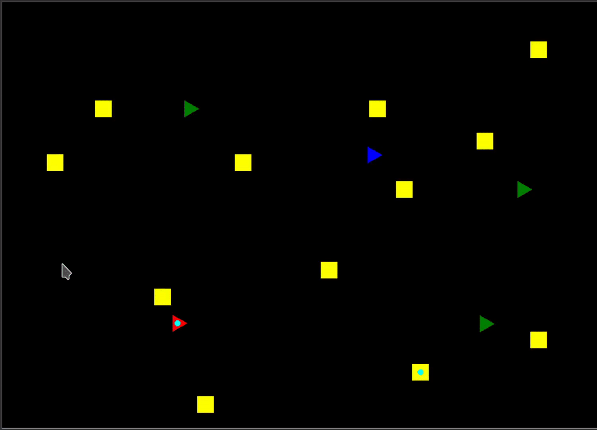

# SimpleRoboFleet
## A very simple Simulation Environment for RoboTaxis



## Why is it made so simple?
* The usage should be very simple 
* The focus should no be to much on the Simulation
* You should be encouraged to add new features

## For what is it useful?
* Test out and optimize different Routing Strategies
* Combine the Simulation Environment with AI Techniques


## Try it out:
```bash
python3 RunSimulation.py
```

### Edit the Simulation Parameters in RunSimulation.py

